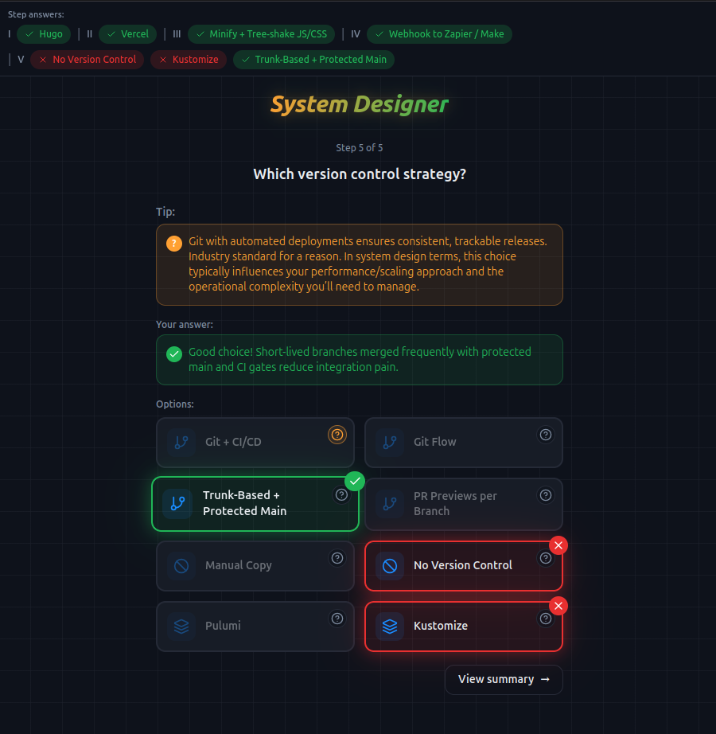

# System Designer

**System Designer** is an interactive system design quiz oriented for mobile social media users willing to learn programming and practice architecture choices. User picks a project type and scale, then answer scenario-based questions. User gets immediate feedback of his choices and can get tips along the way, at the end the sum up of the created system is given with a score out of 10.


## Local development

### Requirements

- **Node.js 18+** (recommended: current LTS)

### Install and run

```bash
npm install
npm run dev
```


## Tech stack

- [Vite](https://vitejs.dev/) — dev server and build  
- [React 18](https://react.dev/) + [TypeScript](https://www.typescriptlang.org/)  
- [React Router](https://reactrouter.com/) — routing  
- [Tailwind CSS](https://tailwindcss.com/) — styling  
- [shadcn/ui](https://ui.shadcn.com/)-style components (Radix, etc.)  
- [TanStack Query](https://tanstack.com/query) — available for data fetching (minimal use in the quiz UI)  
- [Vitest](https://vitest.dev/) — tests  

